

  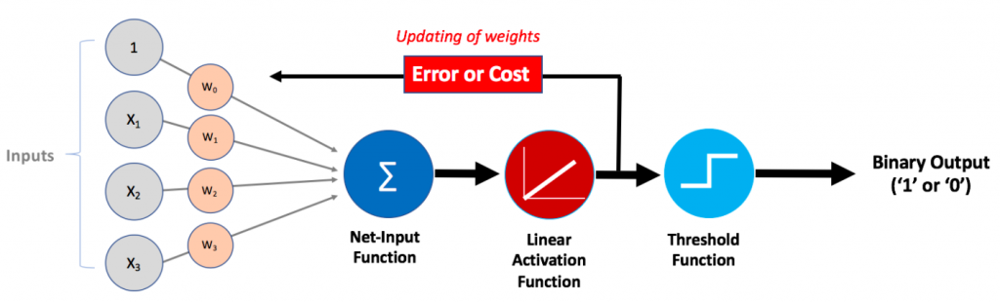
  <h1> Adaptive Linear Neuron (Adaline) </h1>

 

### Table of Accuracy Results 📊

|                        |    Beit vs Lamed  |    Beit vs Mem    |    Lamed vs Mem   |
|  --------------------  | :---------------: | :---------------: | :---------------: |
|   **Cross Val 1**      |0.7831              |0.7631            |0.8092             |
|   **Cross Val 2**      |0.8193              |0.7751            |0.7851             |
|   **Cross Val 3**      |0.7932              |0.7691            |0.8193             |
|   **Cross Val 4**      |0.7671              |0.7610            |0.8173             |
|   **Cross Val 5**      |0.7928              |0.7706            |0.8089             |
|     **Average**        |0.8091              |0.7782            |0.8316             |
| **Standard Deviation** |0.0170              |0.0121            |0.0051             |
  

---
**<h1 align="center">Part I</h1>**

### Dataset 🎨

Our dataset is substantial, containing a total of 2000 matrices of Mem, Beit, and Lamed Hebrew Letters, which we meticulously created for this project.

We will provide a [script](Dataset/createData.py) that allows you to generate your dataset by inserting images of each Mem, Beit, and Lamed letter. 📁 This script creates 27 data matrices for each set of 9 input images (3 of each).

Additionally, we collaborated with a group of students, each contributing their set of 27 letter matrices using the same code. Together, we reached a dataset size of over 2000, ensuring the richness and diversity of our dataset.

  
---
**<h1 align="center">Part II</h1>**

### Story 📖

In our journey to improve the accuracy of our Adaline model, we embarked on a data cleaning adventure. 🧹 We rid our dataset of irrelevant information, such as vectors with all values of -1 or 1, and vectors that didn't have a size equal to 101. 🧽 Additionally, we excluded vectors with fewer than 4 positive or negative pixels. After this meticulous data cleaning, we divided it into three distinct groups: rotated data, clean data, and the full dataset. Finally, we shuffled the data to ensure our model wouldn't be biased towards any particular order. ♻️

With our data now pristine, we ventured into the wilderness of hyperparameter optimization, using the mystical technique known as random search. 🧙‍♂️

## Hyperparameter Optimization 🔍

To evaluate the effectiveness of our chosen hyperparameters in representing the data, we harnessed the power of 5-fold cross-validation. 🧮 This allowed us to discover the optimal hyperparameters for our model, including the learning rate, weight initialization standard deviation, and batch size. 📈

With our newfound wisdom, we trained three models using these carefully chosen hyperparameters and reported the results. 🌟

### Results 📊

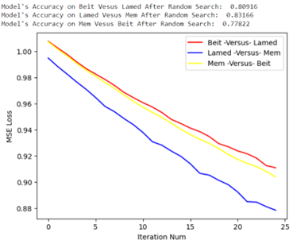

## Model Predictions 🧮

Behold the predictions of our models on a sample batch of size 50, brought to life through the magic of visualization! 📊📈📉

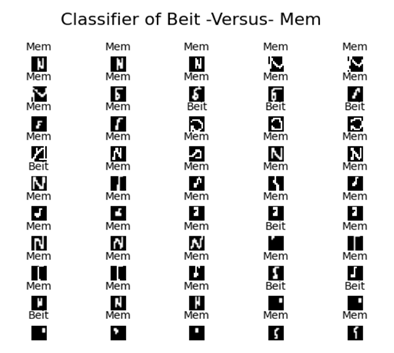 

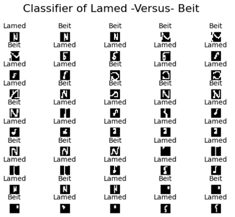 

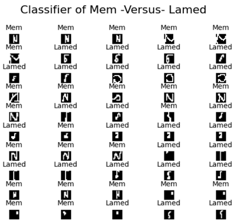 

  
---
**<h1 align="center">Part III</h1>**

### Overview

We've enhanced the Adaline algorithm using a neural network architecture implemented in PyTorch. This improved model consists of 4 layers with 3 activation layers using ReLU. Let's dive into the details of our approach!

## Architecture

**Layer 1:** Input layer with a shape of (100, 128) for better data representation. 
**Layer 2:** (128, 64) to aggregate features from the initial 128 dimensions. 
**Layer 3:** (64, 3) to reduce features to distinct classifications.

## Data Splitting

We divided our data into three parts & created separate datasets for each.

**Train:** 70% 
**Validation:** 20% 
**Test:** 10% 

## Training

We used the Adam optimizer, known for its adaptive learning rates and momentum. Our training process involved:

* Batch size: 50 examples per batch
* Epochs: 20
* Hyperparameter tuning using random search for weight initialization scale and learning rate.

## Model Selection

To find the best model, we compared them based on their validation accuracies. The model with the highest validation accuracy was selected.

## Resualts
Here are the results for the 4 models trained:

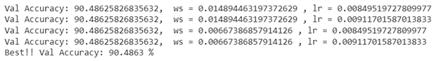 

## Test Accuracy
We plotted the test accuracy of the best model along with the cross-entropy loss by iteration. We achieved a remarkable test accuracy of 84.87%! 🎯

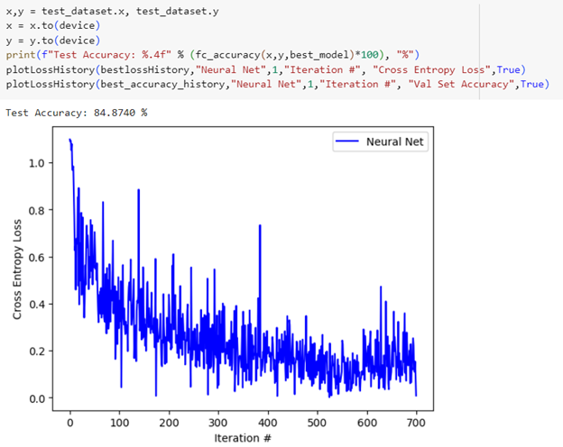 

## Validation Accuracy
Check out the validation accuracy over the number of iterations for our best neural net! 📈

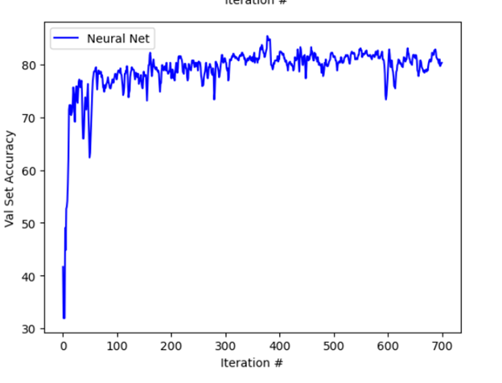 

## Model Predictions
Explore the model's predictions on a sample of 50 test examples! 👁️‍🗨️

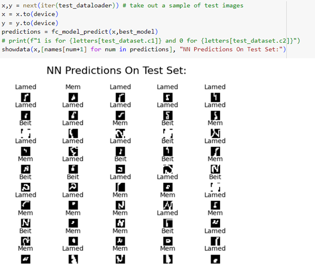 

## Model Scores
We ran the model on the test dataset and plotted the values of the last 3 neurons. The color represents the actual prediction using the softmax classification technique:

Blue: Lamed 
Red: Beit 
Green: Mem 

Our model provides a clear division of the three classes! 🌈

| Models predictions | Actual Labeling |
| :---------: | :---------: |
| 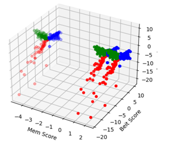 | 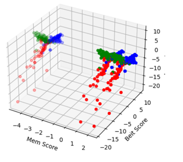 |

  
# How To Run 🏃‍♂️

1. Mount your Mem, Beit, Lamed dataset to Google Drive. I added a [script](Dataset/createData.py) to create your dataset and an [example](Dataset/inputImageExample.png) of how an input Letter PNG should look like.
2. In the [assignment solution](NeuroEx1.ipynb), change the **FOLDERNAME** to the name of the folder where you saved your dataset.

| Our folder for example |
| :---: |
| 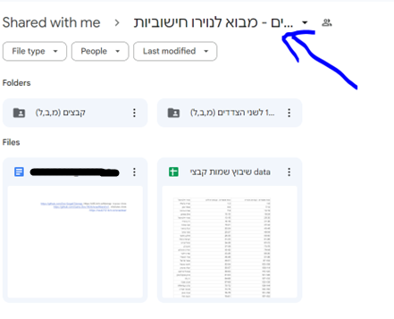  |

3. Open the [Google Colab Python notebook](NeuroEx1.ipynb).
4. If needed, connect to the runtime by clicking on "Reconnect," like so:

| Reconnect |
| :---: |
| 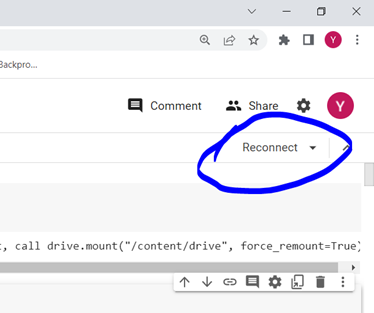  |

5. You can then run each cell independently or click "Run all" to execute all cells. We've already run all cells in advance for your convenience.

## 📜 License

This project is licensed under the [Creative Commons Attribution-NonCommercial 4.0 International License (CC BY-NC 4.0)](https://creativecommons.org/licenses/by-nc/4.0/). This means that you are free to share, adapt, and build upon the material, as long as you provide appropriate attribution, do not use the material for commercial purposes, and do not impose additional legal restrictions.

Please note that this license is designed to prevent commercial usage of the code. If you have any questions about how you can use or adapt this code within the terms of the license, feel free to open an issue.

## 📬 Contact

If you have any questions, suggestions, or feedback, please don't hesitate to open an issue.

<!-- # Table of Accuracy Results:

|                      |   Bet vs Lamed   |   Bet vs Mem     |   Lamed vs Mem   |
| -------------------- | ---------------  | ---------------  | ---------------  |
|  **Cross Val 1**     |                  |                  |                  |
|  **Cross Val 2**     |                  |                  |                  |
|  **Cross Val 3**     |                  |                  |                  |
|  **Cross Val 4**     |                  |                  |                  |
|  **Cross Val 5**     |                  |                  |                  |
|    **Average**       |                  |                  |                  |
|**Standard Deviation**|                  |                  |                  | -->
